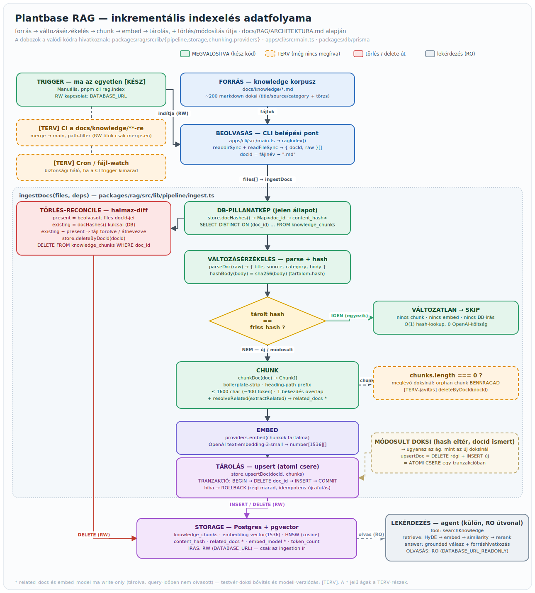

# Plantbase

Parancssori (CLI) **AI agent**, amely egy növény-katalógus felett válaszol
természetes nyelvű kérdésekre. A felhasználó magyarul kérdez (pl. _„mi a
legolcsóbb kaktusz raktáron?"_), az agent a kérdést **SQL-re fordítja**,
**read-only** lefuttatja a `products` táblán, és az eredményből **természetes
nyelvű választ** ad — önkiszolgáló analitika SQL-tudás nélkül.

A célpersona egy lakberendező, aki így percek alatt (a korábbi 10–15 perc
helyett) állít össze egy szobához illő növénycsomagot. Részletes üzleti leírás:
[docs/brs-plantbase.md](docs/brs-plantbase.md).

## Architektúra

Nx + pnpm monorepo, framework-agnosztikus maggal
([docs/architektura.md](docs/architektura.md)):

```
plantbase/
├── packages/core   agent-logika (LLM-hívás, runSql tool, séma-kontextus, naplózás)
├── packages/db     Prisma lib (séma, migráció, kliens, seed) — külön libben, nem a gyökérben
├── apps/cli        CLI (ask parancs + interaktív mód)
└── docs            dokumentáció
```

Kulcsfájlok: [ask-agent.ts](packages/core/src/lib/ask-agent.ts) (a
tool-use loop), [tools/registry.ts](packages/core/src/lib/tools/registry.ts)
(tool-regiszter: definíció + handler), [tools/run-sql.ts](packages/core/src/lib/tools/run-sql.ts)
(SELECT-guard), [tools/list-categories.ts](packages/core/src/lib/tools/list-categories.ts),
[system-prompt.ts](packages/core/src/lib/system-prompt.ts),
[main.ts](apps/cli/src/main.ts) (CLI belépési pont).

Főbb döntések:

1. **Framework-agnosztikus core.** A `packages/core` nem ismeri a belépési
   pontokat (CLI/API/web). Új felület = új app, nem újraírás.
2. **Két DB-kapcsolat, két jog.** Az agent `runSql`-je **read-only**
   kapcsolaton fut (`DATABASE_URL_READONLY`), csak SELECT. A Prisma read-write
   kapcsolaton (`DATABASE_URL`) viszi a sémát, migrációt, seedet. Az agent nem
   Prismán kérdez.
3. **Saját agent-loop.** Az `askAgent` az Anthropic SDK-ra épülő, kézzel írt,
   többlépéses tool-use loop, agent-framework nélkül — hogy a mechanika látható
   maradjon.
4. **Átláthatóság beépítve.** Minden interakció JSONL-be naplózva a `logs/`
   alá; a `--show-prompt` kiírja a teljes promptot.
5. **Lokális DB.** docker-compose Postgres (OrbStack futtatja), nincs felhő-DB.

Tech stack: TypeScript (strict), Nx, pnpm, Node 22 LTS, PostgreSQL + Prisma,
Anthropic SDK + Zod, commander + node:readline, Vitest, ESLint + Prettier, tsx.
Részletek és a `products` séma: [docs/stack.md](docs/stack.md).

## Tudásbázis (RAG)

A katalógus-lekérdezés mellett az agent egy **növénygondozási tudásbázisból** is tud
grounded (forrásmegjelölt) választ adni, a `docs/knowledge/**` markdown-korpuszból (~200
cikk). A `searchKnowledge` agent-tool egy **RAG-pipeline**-t hív: HyDE → OpenAI-embedding →
pgvector similarity-keresés → Jina rerank → küszöbölt, forráshivatkozott válasz. Az indexelés
**inkrementális**: tartalom-hash (sha256) alapú változásérzékeléssel a változatlan cikkek nem
embeddelődnek újra (0 OpenAI-hívás), a törölt és a módosult cikkek pedig automatikusan
reconcile-olódnak (utóbbi atomi `DELETE+INSERT` cserével egy tranzakcióban).

- Belépési pontok: `pnpm cli rag:index` (indexelés, **RW**) · `pnpm cli rag:golden`
  (regressziós kiértékelés golden kérdéskészleten, **RO**).
- Külön csomag: `packages/rag` (`pipeline` / `storage` / `chunking` / `providers`).
- Tárolás: Postgres + **pgvector** (`knowledge_chunks` tábla, HNSW cosine index); az agent az
  eddigi **read-only** kapcsolaton olvassa (`DATABASE_URL_READONLY`), csak az `rag:index` ír.
- Részletek (mag vs. terv, edge case-ek): [docs/RAG/ARCHITEKTURA.md](docs/RAG/ARCHITEKTURA.md).

Az alábbi ábra a teljes indexelési adatfolyamot mutatja — **forrás → változásérzékelés →
chunk → embed → tárolás**, a **törlés/módosítás** úttal együtt:



### Chunkolás — hogyan lesz egy cikkből kereshető darab

Egy markdown-cikket nem egészben embeddelünk, hanem **értelmes, önmagukban is
grounded darabokra** (chunk) vágjuk. A teljes logika a
[chunker.ts](packages/rag/src/lib/chunking/chunker.ts)-ben él; egyszerűsítve öt lépés:

1. **Boilerplate-szűrés.** Indexelés előtt kivágjuk a nem-tartalmi, ismétlődő
   blokkokat: a `Perfect Pairings` és a `Words By The Sill` szekciókat (a fájl
   végéig), a `Learn More` navigációt és a `Shop …!` upsell-sorokat. Így az
   embedding a valódi gondozási tudásra fókuszál, nem a webshop-sablonra
   (`stripBoilerplate`).

2. **Szekciókra bontás + kontextus-prefix.** A törzset a markdown-headingek
   (`##` > `###` > `####`) mentén szekciókra bontjuk, és minden chunk elé
   odabiggyesztjük a **cím + heading-útvonalat** (pl. `How To Care for a
Monstera — Water`). Így egy darab magában is „tudja", miről és minek a
   részeként szól — és **egy chunk soha nem lép át szekcióhatárt**.

3. **Méret.** Egy chunk törzse legfeljebb **~1600 karakter (~400 token)**. A
   bekezdéseket bekezdés-határon pakoljuk egy chunkba, amíg beleférnek; egy
   túl hosszú bekezdést előbb **mondathatáron** (`. ! ?`), végső esetben kemény
   karakter-ablakokban szeletelünk szét.

4. **Overlap (átfedés).** Két egymást követő chunk nem élesen vágódik el: az
   előző chunk **utolsó bekezdését** átvisszük a következő elejére (**1
   bekezdés átfedés**), hogy a határon átívelő gondolat egyik darabból se
   hiányozzon a kereséskor. Az átfedést csak akkor visszük tovább, ha a chunk
   **vele együtt is** a méretkorlát alatt marad.

5. **Referenciák (cross-ref).** A cikkek `Learn More` listájából kinyerjük a
   hivatkozott cikkcímeket (`extractRelated`), majd a korpusz frontmatter-címeire
   feloldjuk őket `doc_id`-kra (`resolveRelated`) — az ismeretlen hivatkozásokat
   eldobva. Ez a `related_docs` oszlopba kerül; ma indexelési melléktermék, a
   query-idejű testvér-chunk behúzás [tervben van](docs/RAG/ARCHITEKTURA.md).

Részletek és edge case-ek: [docs/RAG/ARCHITEKTURA.md](docs/RAG/ARCHITEKTURA.md).

## Indítás

1. **Node 22** (a repó `.nvmrc`-je):

   ```bash
   nvm use 22
   ```

2. **Környezeti változók** — másold a `.env.example`-t `.env`-be és töltsd ki
   (`ANTHROPIC_API_KEY`, Postgres-jelszavak). Az `ANTHROPIC_MODEL` alapból
   `claude-sonnet-4-6`.

3. **Adatbázis** — Postgres a seedelt katalógussal:

   ```bash
   docker compose up -d
   ```

4. **Az agent futtatása:**

   ```bash
   pnpm cli ask "mi a legolcsóbb kaktusz raktáron?"   # egyszeri kérdés
   pnpm cli chat                                        # interaktív mód (kilépés: exit)
   pnpm cli --show-prompt ask "..."                     # a teljes prompt kiírásával
   ```

5. **Tesztek / típusellenőrzés / lint:**

   ```bash
   pnpm vitest              # tesztek
   pnpm nx typecheck core   # típusellenőrzés (a mag)
   pnpm lint                # ESLint (flat config), pnpm lint:fix a javításhoz
   pnpm format              # Prettier az egész repóra
   ```

   Szerkesztés után **Claude Code hookok** (`.claude/settings.json`, `PostToolUse`
   / `Edit`) automatikusan lefuttatják a `prettier --write`-ot és a szerkesztett
   fájlhoz tartozó `vitest related` tesztet — így a formázás és a tesztek
   azonnal érvényesülnek. Részletek: [docs/dev-workflow.md](docs/dev-workflow.md).

## Custom skillek

A [.claude/skills/](.claude/skills/) alatt két projekt-specifikus skill él.
Ezek a `/<skill-név>` beírásával, vagy automatikusan (a leírásuk alapján)
hívódnak, amikor a kérés illik rájuk. Mindkettő futtatásához Node 22 kell.

- **`new-agent-tool`** — új tool scaffoldolása az agent **tool-regiszterébe**
  ([tools/registry.ts](packages/core/src/lib/tools/registry.ts)), a repó meglévő
  mintája szerint (runSql, listCategories). Végigviszi a fix **4 lépést**:
  implementációs fájl → teszt (TDD) → regisztráció (definíció + handler a
  `TOOLS` mapbe — a loopot nem kell módosítani) → **system prompt frissítése**
  (ez a leggyakrabban kifelejtett lépés) → opcionális export. Akkor indul, ha az
  agentnek új adat-képességet akarsz adni (pl. „adj egy `findCheapest` toolt").

- **`agent-eval`** — regressziós kiértékelés a valódi agenten egy golden
  kérdéskészlettel. Kétlépéses: (1) determinista futtatás scripttel (élő API +
  DB → `logs/eval/<timestamp>/results.json`), (2) grading, amelyet Claude végez
  (`must_include` / `should_ask_back` / `expects` kritériumok). Akkor használd,
  ha a system promptot, a modellt, egy toolt vagy a loopot módosítottad, és
  tudni akarod, nem romlott-e el a viselkedés — pl. mielőtt egy
  agent-változtatást mergelnél.

Új skillt a `.claude/skills/<név>/SKILL.md` létrehozásával adhatsz hozzá
(frontmatter `name` + `description` — utóbbi dönti el, mikor triggerelődik).

## System prompt — legutóbbi változások

Az agent system promptja
([system-prompt.ts](packages/core/src/lib/system-prompt.ts) a futásidejű,
[docs/system-prompt.md](docs/system-prompt.md) a termék-doksi verzió) az alábbi
pontokkal bővült:

1. **`listCategories` a `<tools>` közé (doksi-szinkron).** A termék-doksi
   `<tools>` szekciója korábban csak a `runSql`-t sorolta fel, holott a tool már
   be volt kötve a loopba. Mostantól a `.md` is dokumentálja a
   `listCategories()`-t, összhangban a futásidejű prompttal.
2. **`<task>` tool-routingra általánosítva.** A korábbi „minden kérdést fordíts
   SQL-re" keretezés a `listCategories` ellen dolgozott. Az új megfogalmazás
   explicit döntést kér: kategória-kérdésre `listCategories`, minden más
   lekérdezésre `runSql` — így a modell nem generál felesleges SELECT-et a
   kategórialistához.
3. **Tool-hiba viselkedés a `<behavior>`-ben.** Új szabály: ha egy tool hibát ad
   vissza, a modell javítsa a lekérdezést és próbálja újra, a nyers
   hibaüzenetet pedig ne adja tovább a felhasználónak.

## Dokumentáció

- [docs/brs-plantbase.md](docs/brs-plantbase.md) — üzleti követelmény-leírás (BRS)
- [docs/architektura.md](docs/architektura.md) — fájlstruktúra és kulcsdöntések
- [docs/stack.md](docs/stack.md) — tech stack és a `products` séma
- [docs/RAG/ARCHITEKTURA.md](docs/RAG/ARCHITEKTURA.md) — RAG tudásbázis: inkrementális indexelés (adatfolyam-ábrával)
- [docs/konvenciok.md](docs/konvenciok.md) — kódolási konvenciók
- [docs/dev-workflow.md](docs/dev-workflow.md) — git, hookok, dokumentációs folyamat
- [docs/system-prompt.md](docs/system-prompt.md) — az agent system promptja
